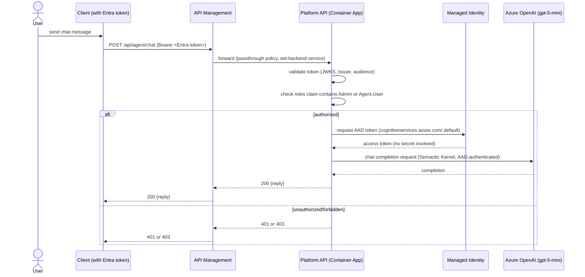

# Sequence Diagram: Agent Chat Request (Milestone 2)

Covers a client calling the Semantic Kernel-backed `/agent/chat` endpoint through APIM,
with the API authenticating to Azure OpenAI via managed identity (no API keys anywhere in
the path).

## Notes

- **No API keys anywhere in this path.** The Container App authenticates to Azure OpenAI via
  its system-assigned managed identity (`Cognitive Services OpenAI User` role, RBAC-only —
  the OpenAI resource has `disableLocalAuth: true`, so API keys don't even exist as an
  option). Locally, the same code path uses the developer's own `az login` credential via
  `DefaultAzureCredential`'s fallback chain — no separate local/cloud auth branches to
  maintain.
- APIM currently runs a passthrough policy (`set-backend-service` to the Container App) —
  no per-route policies yet. Rate limiting, caching, or request/response transformation would
  attach here in a later milestone if needed.
- Authorization is `Admin` **or** `Agent.User` (see `apps/api/app/auth.py`'s
  `require_any_role`) — an Auditor-only token gets a 403, consistent with the RBAC model in
  `docs/security-model.md`.
