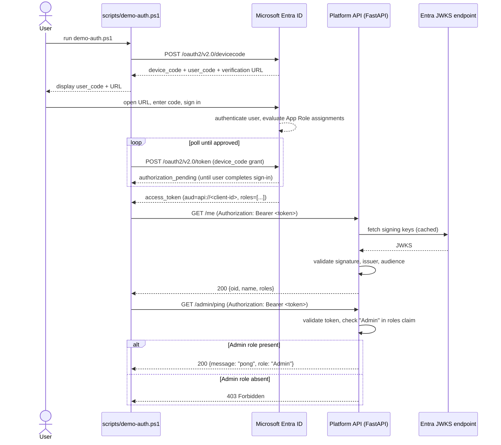

# Sequence Diagram: End-to-End Authentication & Authorization

Covers the Milestone 1 auth demo: a user signs in via the OAuth2 device-code flow and calls
the platform API, which validates the token and enforces role-based authorization.

## Notes

- Token validation (`apps/api/app/auth.py`) checks signature (against the tenant's JWKS,
  cached after first fetch), issuer, and audience — not just presence of a token.
- Authorization is claim-based (`roles` claim, populated from Entra ID App Role
  assignments) rather than a separate authorization service — appropriate for a single API;
  revisit if/when multiple services need a shared authorization decision point.
- The device-code flow is used here because the demo client is a script, not a browser app.
  A future web frontend (if `/apps/web` is built per the Power Apps evaluation in ADR-0001)
  would use the authorization-code flow with PKCE instead.
